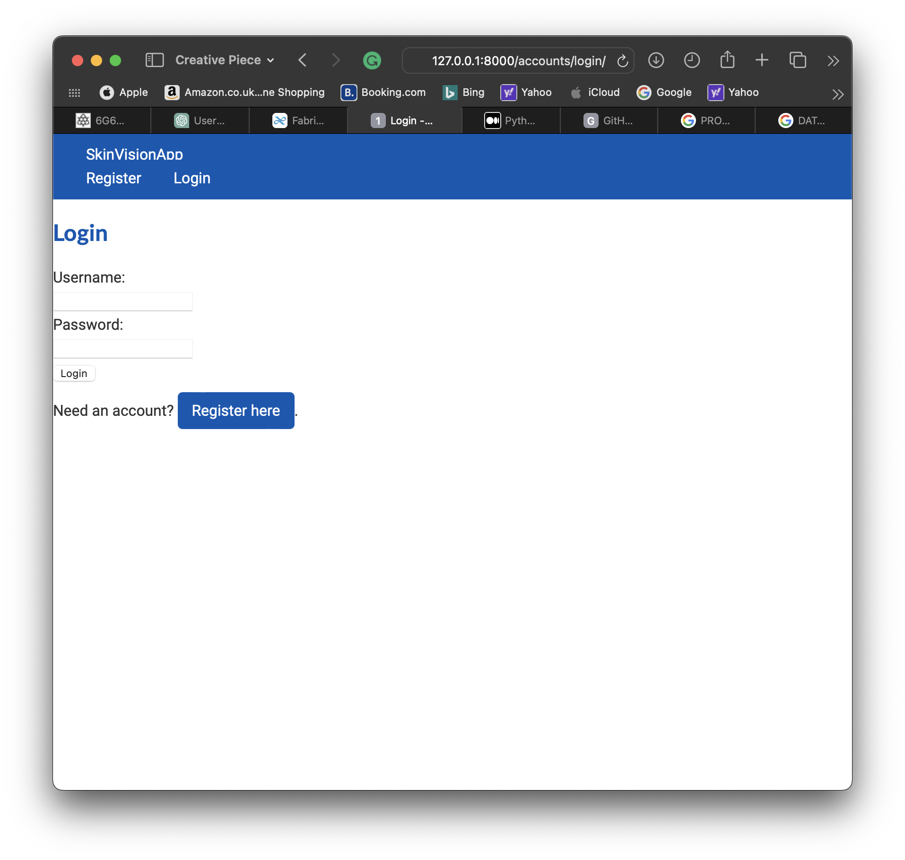
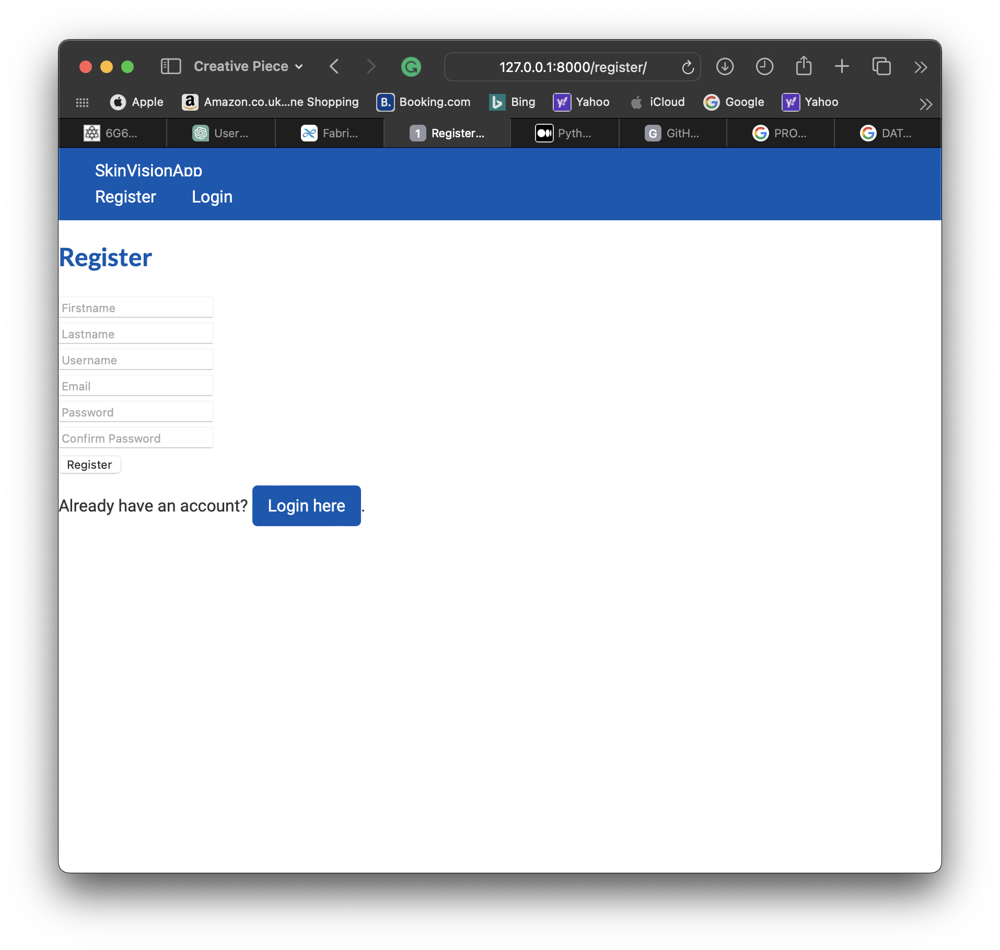
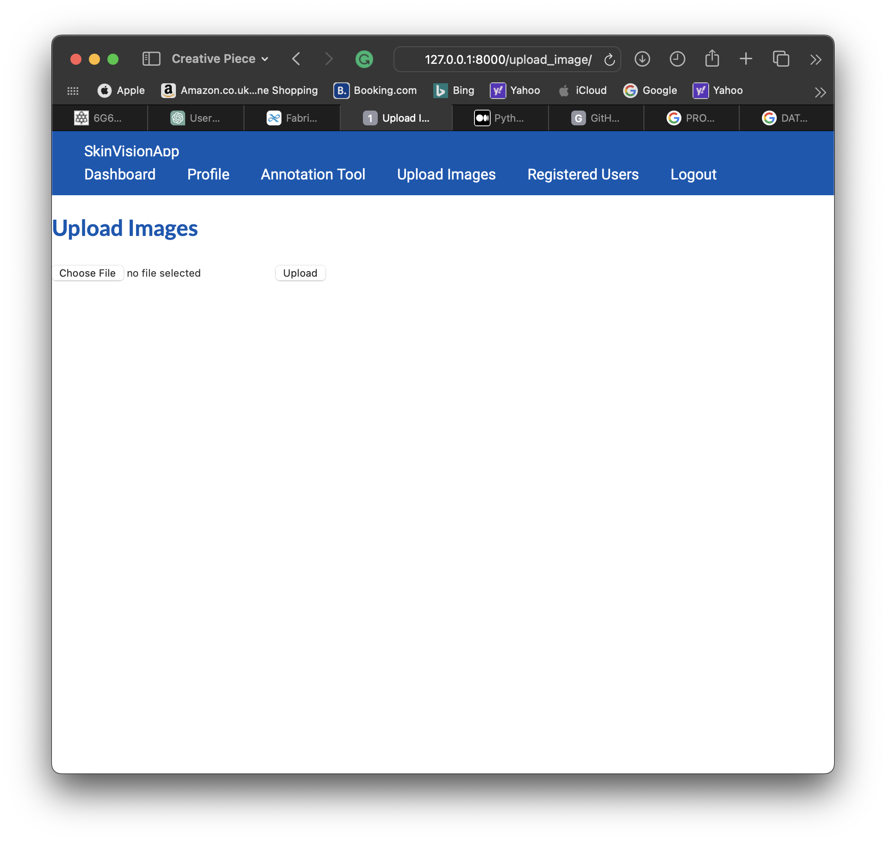
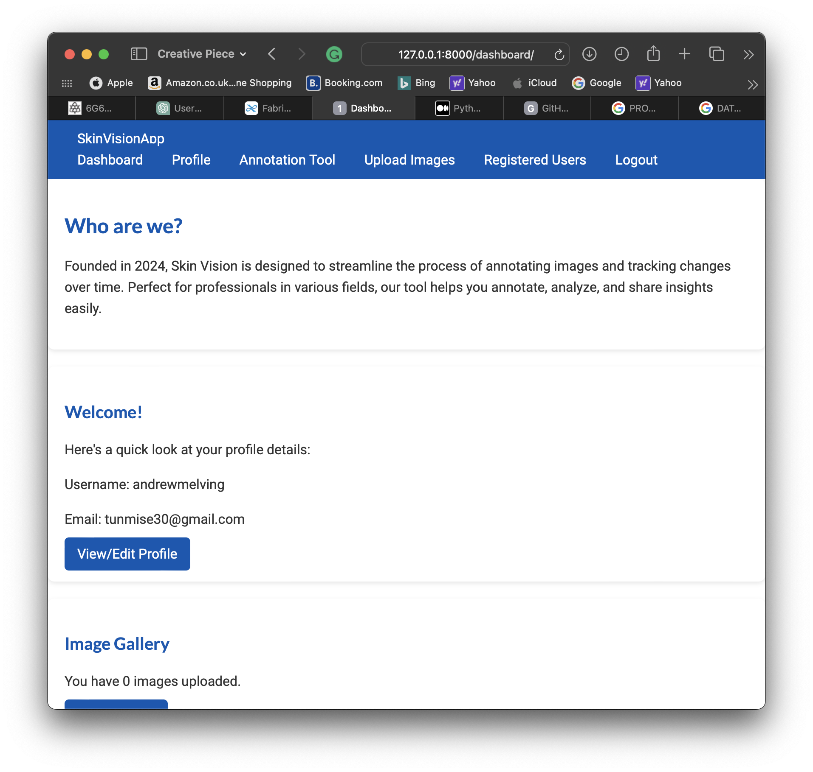
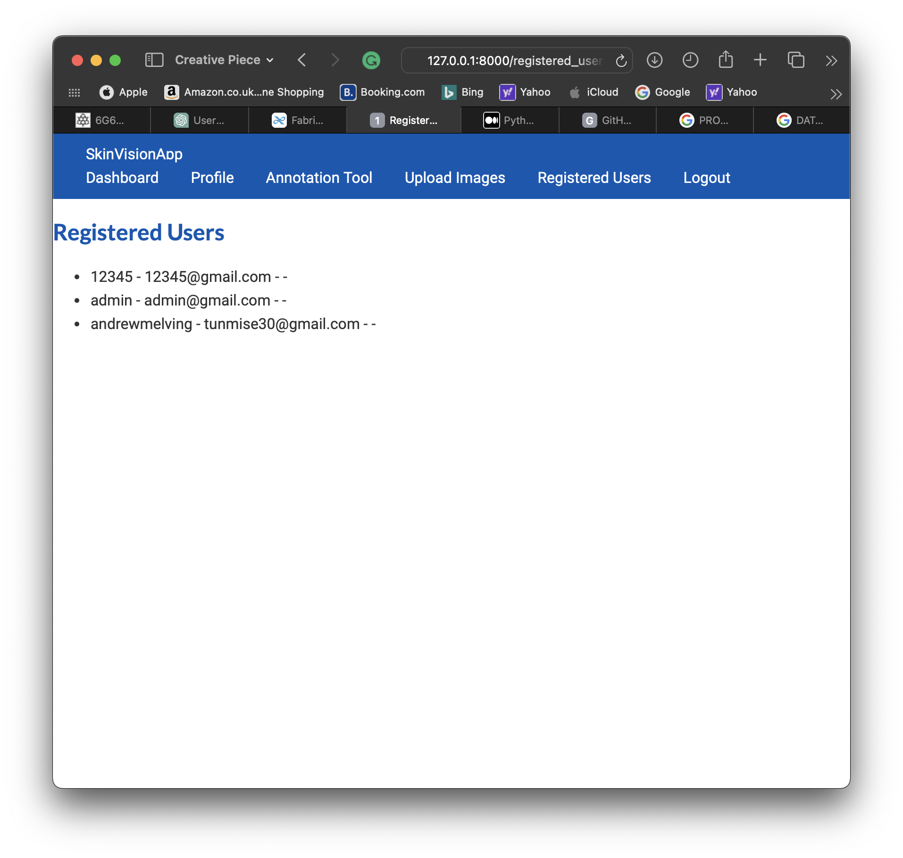

# 🧠 SkinVision – Skin Cancer Annotation Tool

SkinVision is a web-based tool designed to assist medical professionals and researchers in annotating dermoscopic images for skin cancer diagnosis. Users can upload skin images, draw annotations directly on them, and export the data for machine learning or clinical review.

## 🎓 Dissertation Context

This project was built as part of my final-year dissertation for a BSc in Software Engineering at Manchester Metropolitan University. It aims to support medical professionals by providing a simple, accessible interface for labelling skin cancer features in medical imagery.

## 🚀 Features

🖼️ Upload dermoscopic images for analysis  
✍️ Annotate and label key skin features  
💾 Save annotation data in a structured SQL database  
📤 Export data for medical or academic use  
🔐 Basic user authentication


## 🛠️ Tech Stack

Backend: Python, Django  
Frontend: HTML, CSS, JavaScript  
Database: SQLite (dev) | PostgreSQL (prod-ready)  
Tools: Django Admin, Pillow, Git/GitHub

## 📁 File Structure (Key Parts)
```text
SkinVisionApp/
├── static/            # Static assets (CSS, JS)
├── templates/         # Django HTML templates
├── views.py           # Core logic for routing and rendering
├── models.py          # Image and user models
├── urls.py            # URL routing
├── userEditForm.py    # Django form for profile editing
├── settings.py        # Django project settings
```


## 🧪 How to Run Locally

1. **Clone the repository**  
*git clone https://github.com/Skrillzzzz/SkinVision.git  
cd SkinVisionApp*

2. **Set up a virtual environment**  
*python -m venv venv  
source venv/bin/activate  # On Windows: venv\Scripts\activate  
Python Interpreter: /backend/venv/bin/python*

3. **Run migrations**  
*python manage.py migrate*

4. **Start the development server**  
*python manage.py runserver*

5. **Access the app**  
*Visit http://127.0.0.1:8000 in your browser.*

## 🧪 Usage Instructions

1. **Login/Register**
   - Start by creating an account or logging in.

2. **Upload Images**
   - Go to 'Upload Images' to submit skin photos.

3. **Annotate Images**
   - Use the 'Annotation Tool' to draw on images and highlight areas of concern.
   - Save annotations — the file is downloaded to your local machine.
   - Upload annotated image using the Upload Image section.

4. **Review Saved Annotations**
   - Navigate to the User Profile > Image Gallery to see past uploads.

## 📸 Pages
### 🔐 Login Page
Simple and secure authentication system.  


### 🧑‍💼 Register Page
New users can sign up with basic information.  


### 👤 User Profile
View and update your account details.  


### ✍️ Edit Profile
Update your personal information.  


### 🖼️ Upload Image
Upload images of skin areas for annotation.  


### 🧩 Annotation Tool
Draw on uploaded images to highlight areas of concern.  


### 📋 Dashboard
Overview of all your uploaded and annotated images.  


### 👥 Registered Users (Admin Only)
View a list of users registered on the platform.  


## 🧪 Future Improvements

Support for multiple annotation shapes (polygon, brush)  
Advanced filtering and image tagging  
Integration with machine learning models for predictive analysis  
Docker support for easier deployment

## 🙋‍♂️ Author

Andrew Melving  
Software Engineering Graduate | Cybersecurity & Full-Stack Enthusiast  
[LinkedIn](https://www.linkedin.com/in/andrew-melving-138483209/) | [GitHub](https://github.com/Skrillzzzz/)
